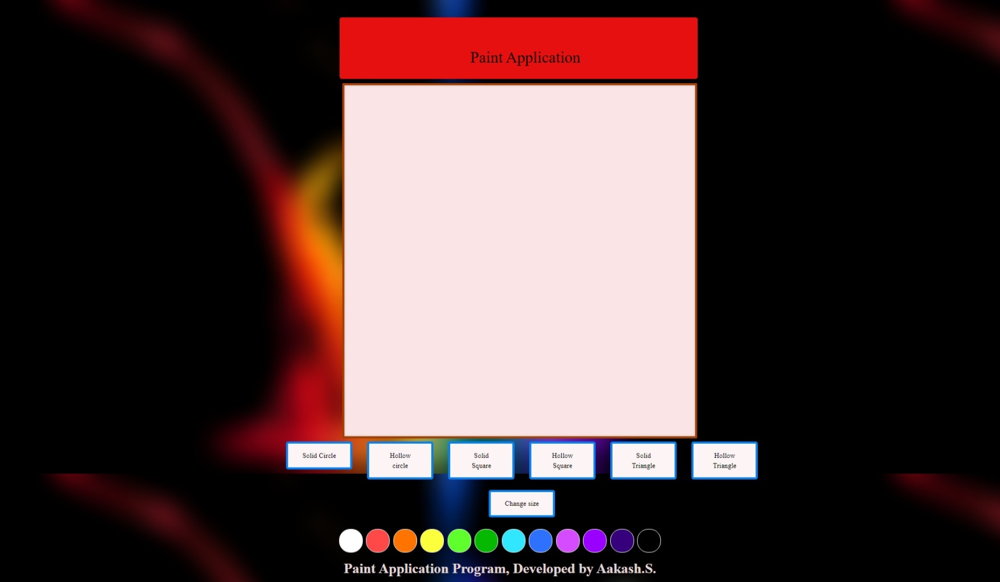
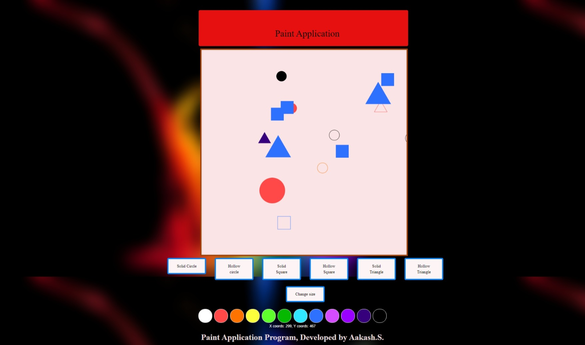
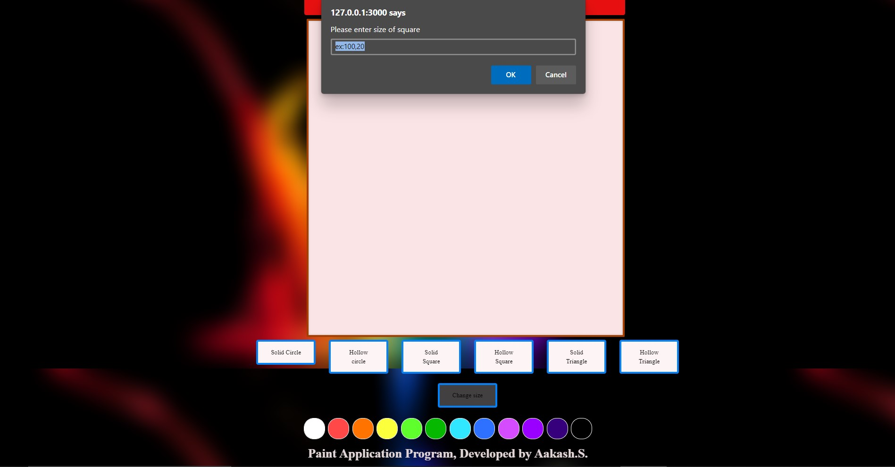
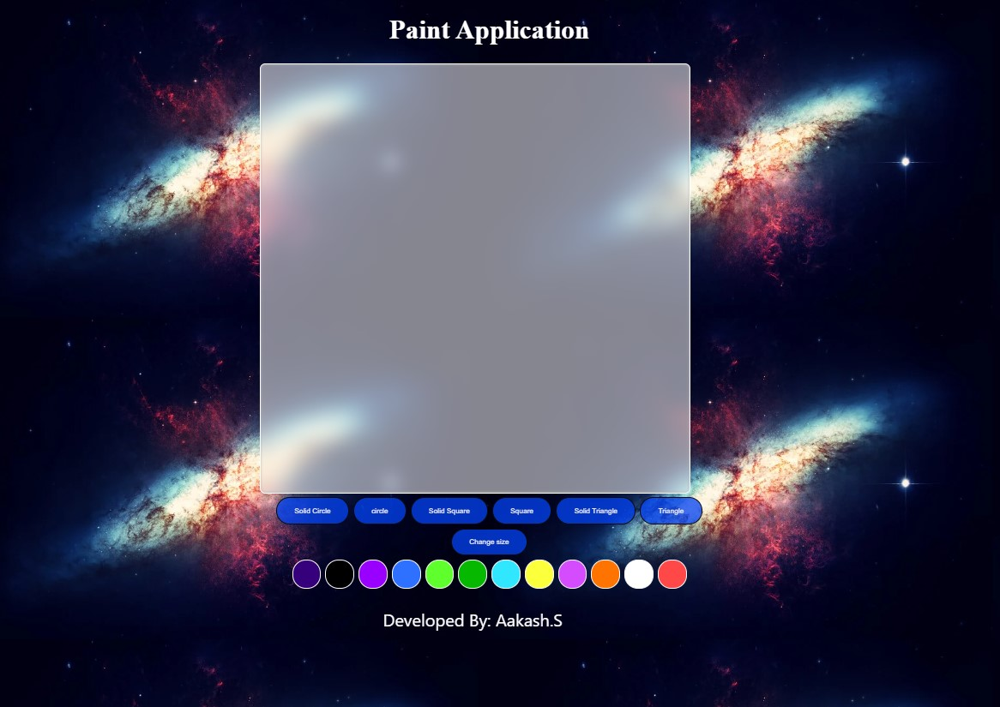
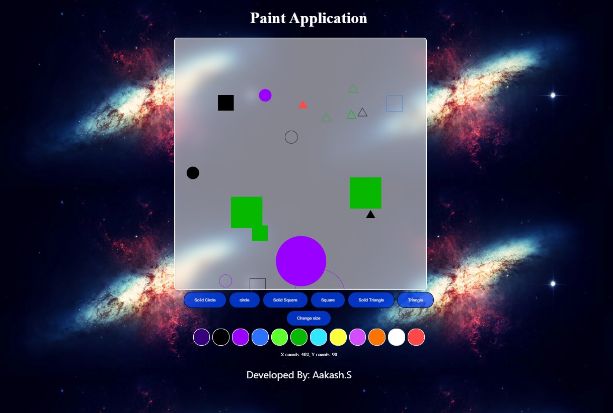
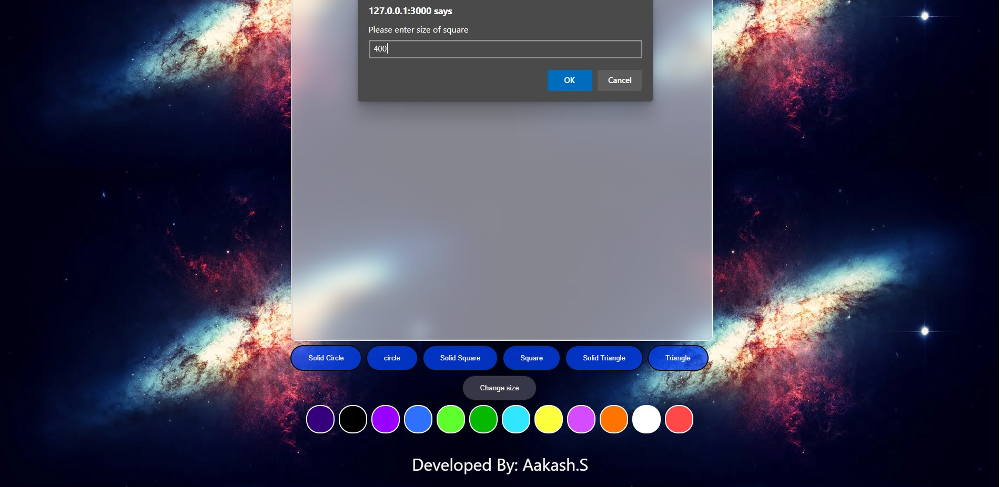

# Web Page for Paint Application

## AIM:

To design a static website for Paint Application using HTML5 canvas.

## DESIGN STEPS:

### Step 1:

Requirement collection.

### Step 2:

Creating the layout using HTML,CSS and canvas.

### Step 3:

Write javascript to capture move events.

### Step 4:

Perform the drawing operation based on the user input.

### Step 5:

Validate the layout in various browsers.

### Step 6:

Validate the HTML code.

### Step 6:

Publish the website in the given URL.

## PROGRAM :
### Application With Bootstrap
```
<!DOCTYPE html>
<html lang="en">
  <head>
    <meta charset="UTF-8" />
    <meta http-equiv="X-UA-Compatible" content="IE=edge" />
    <meta name="viewport" content="width=device-width, initial-scale=1.0" />
    <title>Paint Application</title>
    <link rel="stylesheet"href="https://maxcdn.bootstrapcdn.com/bootstrap/3.3.7/css/bootstrap.min.css">
    <script src="https://maxcdn.bootstrapcdn.com/bootstrap/3.3.7/js/bootstrap.min.js"></script> 
    <script src="https://code.jquery.com/jquery-latest.js"></script>
    <link rel="icon" href="./img/logo.png" type="image/x-icon" />
    <style>

        #myCanvas{
          background-color: #FBE4E6;
          box-shadow: inset 0 0 5px #b6b6b6; 
          backdrop-filter: blur(15px);
          border-radius: 2px;
          border: 5px solid #a54005;
        }
        #buttonstyle{
          background-color: #FDF5F5;
          border: 5px solid #0681f5;
          border-radius: 5px;
          color: rgb(0, 0, 0);
          padding: 15px 32px;
          text-align: center;
          display: inline-block;
          font-size: 16px;
          font-family: bold ;
          margin: 2px 2px;
          cursor: pointer;
        }
        #buttonstyle:hover{
            background-color:#ffffff36;
            transition: 0.5s;
        }
        #bgimg{
            background-image: url(./EEE.png);
        }
        #shooky{
            border: 2px solid #ffffff;
            border-radius: 25px;
            padding: 25px 25px;
            text-align: center;
            display: inline-block;
            font-size: 16px;
            margin: 4px 2px;
            cursor: pointer;
        }
        #shooky:hover{
            opacity: 20%;
            transition: 0.21s;
        }
        .pad{
            margin-left: 650px;
            margin-right: 550px;
        }
        .da{
            text-align: center;
            padding-top: 50px;
            padding-left: 200px;
            padding-right: 120px;
            border-radius: 5px;
            background-color: rgb(231, 16, 16);
            margin-left:205px;
            margin-right: 120px;
            margin-top: 40px;
        }
        .text{
          padding-right: 50px;
         padding-bottom: 20px;
         color: black;
         font-size: 40;
         font-family: bold;
        
        }
        </style>
  </head>
  <body id="bgimg">
      <div class="container">
        <div class="da">
          <div class="text">
        <center><h1>Paint Application</h1></center> 
      </div>
      </div>
      </div>
    <div class="container" style="margin-top: 10px; padding-left: 225px;">
      <canvas id="myCanvas" width="800" height="800" onclick="showCoords(event)"></canvas></div>
      <div class="pad">
      <div class="row">
      <div class="col-md-2">
      <button onclick="shape=1" id="buttonstyle" >Solid Circle</button>
     </div>
     <div class="col-md-2" >
      <button onclick="shape=2" id="buttonstyle">Hollow circle</button>
     </div>
     <div class="col-md-2">
      <button onclick="shape=3" id="buttonstyle">Solid Square</button>
      </div>
      <div class="col-md-2" >
      <button onclick="shape=4" id="buttonstyle">Hollow Square</button>
      </div>
      <div class="col-md-2 ">
      <button onclick="shape=5" id="buttonstyle">Solid Triangle</button>
      </div>
      <div class="col-md-2" >
      <button onclick="shape=6" id="buttonstyle">Hollow Triangle</button>
      </div>
      </div>    
      <br>
      <center>
        <button onclick="size()" id="buttonstyle" >Change size</button>
      </center>
      <br>
      </div>
    </div>

      <center>
      <button onclick="change_color(this)" id="shooky" style="background: white;"></button>
      <button onclick="change_color(this)" id="shooky" style="background: rgb(255, 72, 72);"></button>
      <button onclick="change_color(this)" id="shooky" style="background: rgb(255, 115, 1);"></button>
      <button onclick="change_color(this)" id="shooky" style="background: rgb(252, 255, 60);"></button>
      <button onclick="change_color(this)" id="shooky" style="background: rgb(94, 255, 45);"></button>
      <button onclick="change_color(this)" id="shooky" style="background: rgb(7, 184, 1);"></button>
      <button onclick="change_color(this)" id="shooky" style="background: rgb(49, 231, 255);"></button>
      <button onclick="change_color(this)" id="shooky" style="background: rgb(46, 112, 255);"></button>
      <button onclick="change_color(this)" id="shooky" style="background: rgb(213, 76, 255);"></button>
      <button onclick="change_color(this)" id="shooky" style="background: rgb(153, 0, 255);"></button>
      <button onclick="change_color(this)" id="shooky" style="background: rgb(54, 0, 124);"></button>
      <button onclick="change_color(this)" id="shooky" style="background: rgb(0, 0, 0);"></button>
      </center>

      <script>


        const canvas = document.getElementById("myCanvas");
        const ctx = canvas.getContext("2d");
        ctx.fillStyle = "#FF0000";
        canvas.height = canvas.width;
        ctx.transform(1, 0, 0, -1, 0, canvas.height);
        let md
ax = canvas.height;
        let yMax = canvas.width;
        let csize= 20;
        let sqsize= 50;
        let tsize=50;
        let tata="black";
        function size(){   
          if (shape==1 ||shape==2){
            let c= prompt("Please enter size of circle", "ex:100,50");
            csize=c;
          } 
          if (shape==3 ||shape==4){
            let s = prompt("Please enter size of square", "ex:100,20");
            sqsize=s;
          }
          if (shape==5 || shape==6){
            let t= prompt("Please enter size of triangle","ex:50,84");
            tsize=t;
          }
        }
        function change_color(element){
          tata=element.style.background;
        }
        function showCoords(event)
        {
          var x = event.clientX-545;
          var y = yMax-event.clientY;
          var coords = "X coords: " + x + ", Y coords: " + y;
          document.getElementById("demo").innerHTML = coords;
    
          if (shape==1){
            ctx.beginPath();
            ctx.arc(x, y, csize, 0, 2 * Math.PI);
            ctx.fillStyle=tata;
            ctx.fill();
          }
          if (shape==2){
            ctx.beginPath();
            ctx.arc(x, y, csize, 0, 2 * Math.PI);
            ctx.strokeStyle=tata;
            ctx.stroke();
          }
          if (shape==3){
            ctx.beginPath();
            ctx.rect(x-(sqsize/2),y-(sqsize/2), sqsize,sqsize);
            ctx.fillStyle=tata;
            ctx.fill();
          }
          if (shape==4){
            ctx.beginPath();
            ctx.rect(x-(sqsize/2),y-(sqsize/2), sqsize,sqsize);
            ctx.strokeStyle=tata;
            ctx.stroke();
          }
          if (shape==6){
            ctx.beginPath();
            ctx.moveTo(x, y);
            ctx.lineTo(x-(tsize/2),y-(tsize*0.86602));
            ctx.lineTo(x+(tsize/2),y-(tsize*0.86602));
            ctx.lineTo(x,y)
            ctx.strokeStyle=tata;
            ctx.stroke();
          }
          if (shape==5){
            ctx.beginPath();
            ctx.moveTo(x, y);
            ctx.lineTo(x-(tsize/2),y-(tsize*0.86602));
            ctx.lineTo(x+(tsize/2),y-(tsize*0.86602));
            ctx.fillStyle=tata;
            ctx.fill();
          }    
        }
      </script>
    <center><p id="demo" style="color: white;"></p></center>
    <p 
    style="font-family: bold; 
    text-align: center;
    color:#e2d5d6;
    font-weight: bold;
    font-size: xx-large;">Paint Application Program, Developed by Aakash.S.</p>
  </body>
</html>
```
## OUTPUT 1:
### Blank Canvas:

### Canvas with different shapes, colors and sizes:

### Alert box for size change:



## Application Without Bootstrap
```
<!DOCTYPE html>
<html>
<body id="jeg">
    <meta charset="UTF-8">
    <meta http-equiv="X-UA-Compatible" content="IE=edge">
    <meta name="viewport" content="width=device-width, initial-scale=1.0">
    <title>Paint Application</title>
    <div class="bad">
    <h1>Paint Application</h1>
    </div>
    <div id="light">
<canvas id="myCanvas" width="800" height="800" onclick="showCoords(event)"></canvas></div>
<center>
<button onclick="shape=1" id="Eren" >Solid Circle</button>
<button onclick="shape=2" id="Eren">circle</button>
<button onclick="shape=3" id="Eren">Solid Square</button>
<button onclick="shape=4" id="Eren">Square</button>
<button onclick="shape=5" id="Eren">Solid Triangle</button>
<button onclick="shape=6" id="Eren">Triangle</button>
<br>
<button onclick="size()" id="Eren" >Change size</button></center>
<center>
<button onclick="change_color(this)" id="col" style="background: rgb(54, 0, 124);"></button>
<button onclick="change_color(this)" id="col" style="background: rgb(0, 0, 0);"></button>
<button onclick="change_color(this)" id="col" style="background: rgb(153, 0, 255);"></button>
<button onclick="change_color(this)" id="col" style="background: rgb(46, 112, 255);"></button>
<button onclick="change_color(this)" id="col" style="background: rgb(94, 255, 45);"></button>
<button onclick="change_color(this)" id="col" style="background: rgb(7, 184, 1);"></button>
<button onclick="change_color(this)" id="col" style="background: rgb(49, 231, 255);"></button>
<button onclick="change_color(this)" id="col" style="background: rgb(252, 255, 60);"></button>
<button onclick="change_color(this)" id="col" style="background: rgb(213, 76, 255);"></button>
<button onclick="change_color(this)" id="col" style="background: rgb(255, 115, 1);"></button>
<button onclick="change_color(this)" id="col" style="background: white;"></button>
<button onclick="change_color(this)" id="col" style="background: rgb(255, 72, 72);"></button>
</center>

<script>


const canvas = document.getElementById("myCanvas");
const ctx = canvas.getContext("2d");
ctx.fillStyle = "#FF0000";
canvas.height = canvas.width;
ctx.transform(1, 0, 0, -1, 0, canvas.height);
let xMax = canvas.height;
let yMax = canvas.width;
let csize= 20;
let sqsize= 50;
let tsize=30;
let tatakae="black";
function size()
{   
if (shape==1 ||shape==2){
    let c= prompt("Please enter size of circle", "ex:100,50");
    csize=c;
} 
if (shape==3 ||shape==4){
    let s = prompt("Please enter size of square", "ex:100,20");
    sqsize=s;
}
if (shape==5 || shape==6){
    let t= prompt("Please enter size of square","ex:50,84");
    tsize=t;
}
}
function change_color(element){
    tatakae=element.style.background;
}

    function showCoords(event)

    {
    var x = event.clientX-545;
    var y = yMax-event.clientY;
    var coords = "X coords: " + x + ", Y coords: " + y;
    document.getElementById("d").innerHTML = coords;
    
        if (shape==1){
            ctx.beginPath();
            ctx.arc(x, y, csize, 0, 2 * Math.PI);
            ctx.fillStyle=tatakae;
            ctx.fill();
        }
        if (shape==2){
            ctx.beginPath();
            ctx.arc(x, y, csize, 0, 2 * Math.PI);
            ctx.strokeStyle=tatakae;
            ctx.stroke();
        }
        if (shape==3){
            ctx.beginPath();
            ctx.rect(x-(sqsize/2),y-(sqsize/2), sqsize,sqsize);
            ctx.fillStyle=tatakae;
            ctx.fill();
        }
        if (shape==4){
            ctx.beginPath();
            ctx.rect(x-(sqsize/2),y-(sqsize/2), sqsize,sqsize);
            ctx.strokeStyle=tatakae;
            ctx.stroke();
        }
        if (shape==6){
            ctx.beginPath();
            ctx.moveTo(x, y);
            ctx.lineTo(x-(tsize/2),y-(tsize*0.86602));
            ctx.lineTo(x+(tsize/2),y-(tsize*0.86602));
            ctx.lineTo(x,y)
            ctx.strokeStyle=tatakae
            ctx.stroke();
        }
        if (shape==5){
            ctx.beginPath();
            ctx.moveTo(x, y);
            ctx.lineTo(x-(tsize/2),y-(tsize*0.86602));
            ctx.lineTo(x+(tsize/2),y-(tsize*0.86602));
            ctx.fillStyle=tatakae
            ctx.fill();
        }
    
    
    }

</script>
<center><p id="d" style="color: white;"></p></center>
<p style="color: white; 
font-family: -apple-system, BlinkMacSystemFont, 'Segoe UI', Roboto, Oxygen, Ubuntu, Cantarell, 'Open Sans', 'Helvetica Neue', sans-serif;
margin-left: 775px; font-size: xx-large;" >
    Developed By: Aakash.S</p>
<style>

.bad{
    color: white;
    font-size: 25px;
    text-align: center;
}
          
#light{
    padding-left: 545px;
   
}
#myCanvas{
    background-color: #ffffff86; 
    box-shadow: inset 0 0 5px #b6b6b6;
    backdrop-filter: blur(15px);
    border-radius: 10px;
    border: 1px solid #ffffff;
}
#Eren{
    background-color: #0242f3c2;
    border: 2px solid rgb(10, 10, 10);
    border-radius: 25px;
    color: rgb(248, 242, 242);
    padding: 15px 32px;
    text-align: center;
    display: inline-block;
    font-size: 20 px;
    margin: 4px 2px;
    cursor: pointer;
}
#Eren:hover{
    background-color:#ffffff36;
    transition: 0.5s;
}
#jeg{
    background-image: url(A.jpg);
}
#col{
    border: 2px solid #ffffff;
    border-radius: 25px;
    padding: 25px 25px;
    text-align: center;
    display: inline-block;
    font-size: 16px;
    margin: 4px 2px;
    cursor: pointer;
}
#col:hover{
    opacity: 20%;
    transition: 0.21s;
}
</style>
</body>
</html>

```
## Output 2 :
### Blank Canvas:

### Canvas with different shapes, colors and sizes:

### Alert box for size change:

## Result:

Thus a website is designed and validated for paint application using HTML5 canvas.
